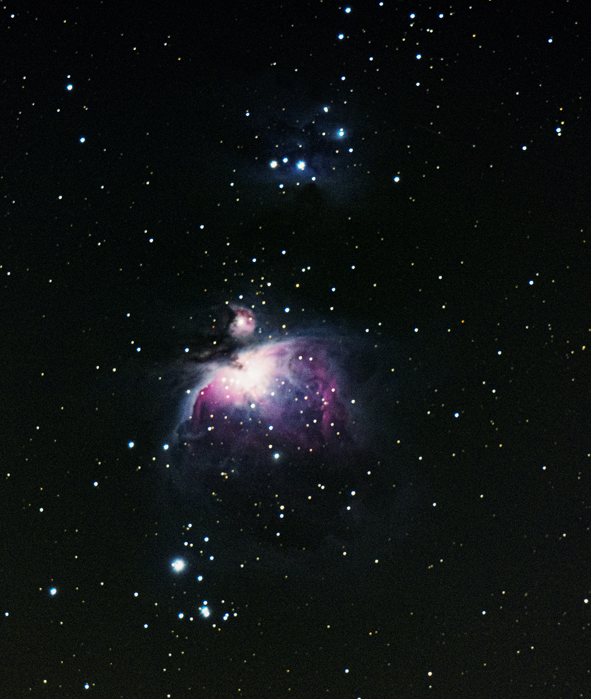
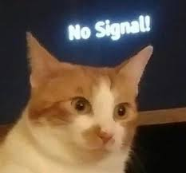

# 🦑 Hi!

I am a M.Sc. Biology Student at University of Hamburg. I code for exact four reasons:

1. I am lazy. Repetitive work is pure agony.
2. I don't trust some people, so I write my code myself.
3. I don't trust myself, so I let code do stuff for me.
4. I am procrastinating.

I mainly use `R` but I will do what I have to do if it doesn't behave. 

Check out my passions and skills at [zzzhehao.github.io](https://zzzhehao.github.io/)

## Random Project

**M42 (Orion Nebula)** - Used processing power to compensate low SNR acquisition since I don't have EQ mount to track object. Stacked from 2000 frames per 0.5 s exposure for total 16 minutes exposure time. This is the best I can get before blowing up my storage and processor.

## Support me

This were my previous meme profile images:

Credits are unknown.
